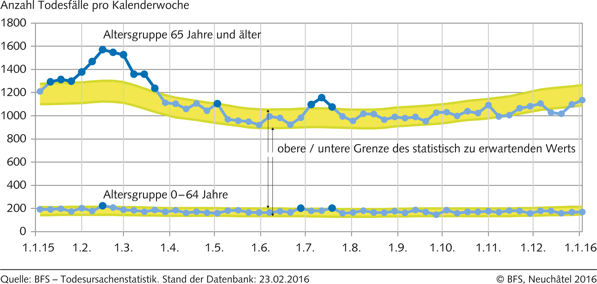
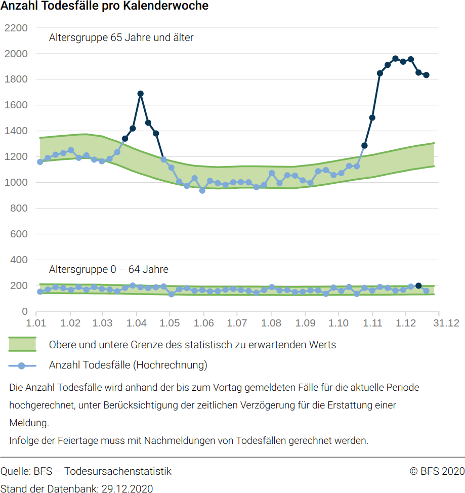
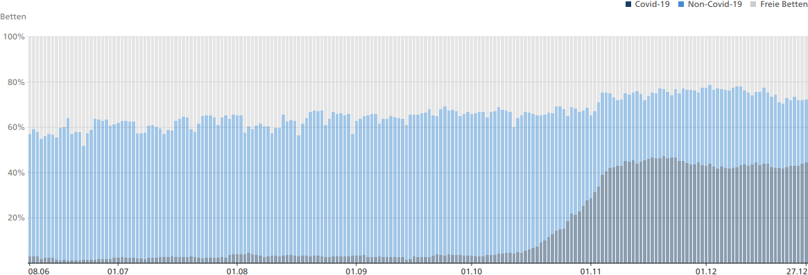

# Vergleich: COVID-19 und Grippe

Mit den gegenwärtig verfügbaren Daten ist es nicht möglich, die Gefährlichkeit des SARS-CoV-2 Virus abschliessend zu beurteilen. Es ist jedoch möglich anhand der **Todesfälle aller Ursachen** eine Idee davon zu bekommen, wie wahrscheinlich es ist in der Schweiz an COVID-19 zu sterben.

Die nächsten Abschnitte führen aus, warum COVID-19 bis jetzt nur unwesentlich gefährlicher ist als eine starke Grippewelle.

## Sterblichkeit in 2020 nur 5% höher als in 2015

Wenn man die Todesfälle aller Ursachen \(siehe [Todesfälle nach Altersklasse, Woche und Kanton](https://www.bfs.admin.ch/bfs/de/home/statistiken/bevoelkerung/geburten-todesfaelle/todesfaelle.assetdetail.15364610.html)\) ins Verhältnis setzt zur Wohnbevölkerung \(siehe [Bevölkerung](https://www.bfs.admin.ch/bfs/de/home/statistiken/bevoelkerung/stand-entwicklung/bevoelkerung.html)\), dann ergibt sich folgendes Bild:

<table>
  <thead>
    <tr>
      <th style="text-align:left">Jahr</th>
      <th style="text-align:left">
        
Todesf&#xE4;lle

        
Wochen 1-51

      </th>
      <th style="text-align:left">Wohnbev&#xF6;lkerung</th>
      <th style="text-align:left">Todesf&#xE4;lle
         pro 100&apos;000</th>
    </tr>
  </thead>
  <tbody>
    <tr>
      <td style="text-align:left">2015</td>
      <td style="text-align:left">66&apos;174</td>
      <td style="text-align:left">8&apos;327&apos;126
         (01.01.2016)</td>
      <td style="text-align:left">795</td>
    </tr>
    <tr>
      <td style="text-align:left">2020</td>
      <td style="text-align:left">71&apos;766</td>
      <td style="text-align:left">8&apos;632&apos;703
         (30.06.2020)</td>
      <td style="text-align:left">831</td>
    </tr>
  </tbody>
</table>

**Demnach war die Wahrscheinlichkeit in den Wochen 1-51 in 2020 zu sterben nur 5% höher als die in den Wochen 1-51 in 2015  zu sterben.** 2015 wurde die Schweiz von einer [relativ starken Grippewelle](https://www.bfs.admin.ch/bfs/de/home/statistiken/kataloge-datenbanken/medienmitteilungen.assetdetail.3742835.html)  heimgesucht.


Die Schweiz ist in dieser Hinsicht kein Einzelfall, wie z.B. [die Zahlen des CDC belegen](https://twitter.com/drdavidsamadi/status/1292754283188948992). Zudem hat das CDC neulich [die sehr tiefen Mortalitätszahlen](https://www.cdc.gov/coronavirus/2019-ncov/hcp/planning-scenarios.html) bestätigt: Nach den besten gegenwärtigen Schätzungen müssen mit SARS-CoV-2 infizierte Personen unter 50 Jahren mit einer maximalen Mortalitätsrate von 0.02% rechnen, für 50-69 jährige beträgt diese 0.5%.


### Fragliche Wirksamkeit der Zwangsmassnahmen

Der an dieser Stelle oft gehörte Einwand, dass die Sterblichkeit nur wegen den Massnahmen nicht höher sei, hält einer genaueren Überprüfung nicht stand. Wenn man verschiedene Länder miteinander vergleicht, gibt es nur einen schwachen Zusammenhang \(Korrelation\) zwischen der Schärfe der verfügten Zwangsmassnahmen und der jeweiligen Sterblichkeit \(und meistens auch der Fallzahlen\). Ein gutes Beispiel dafür ist die [Maskenpflicht](wirksamkeit-von-masken.md#12-kurven-die-zeigen-dass-die-maskenpflicht-covid-nicht-aufhaelt).

Selbst unter der Annahme, dass eine starke Korrelation existiert, stellt dies noch keinen Beweis für die Wirksamkeit der Massnahmen dar, denn [Korrelation ist nicht gleich Kausalität](https://wissenschafts-thurm.de/grundlagen-der-statistik-korrelation-ist-nicht-kausalitaet/). Für einen Beweis ist zusätzliche Evidenz notwendig.

## Vergleich der Sterblichkeit in 2015 und 2020

Das Bundesamt für Statistik \(BFS\) veröffentlicht auf der Seite [Sterblichkeit, Todesursachen](https://www.bfs.admin.ch/bfs/de/home/statistiken/gesundheit/gesundheitszustand/sterblichkeit-todesursachen.html) auch Grafiken, welche die Übersterblichkeit visualisieren. In den folgenden Abschnitten wird die Sterblichkeit in 2015 mit derjenigen von 2020 verglichen. **In beiden Fällen ist fast ausschliesslich die Altersgruppe ab 65 Jahre betroffen.**

### 2015

Die vergleichsweise hohe Zahl an Todesfällen im Frühjahr 2015 [schreibt das BFS einer starken Grippewelle zu](https://www.bfs.admin.ch/bfs/de/home/statistiken/kataloge-datenbanken/medienmitteilungen.assetdetail.3742835.html) \(die kleinere Spitze im Sommer wird der Hitze zugerechnet\).

### 2020

## Die Spitäler sind nicht überlastet

Der ebenfalls oft gehörte Einwand, dass die Bettenkapazität in den Intensivstationen bald ausgeschöpft sei, hält einer genaueren Überprüfung auch nicht stand. Laut den [offiziellen Zahlen](https://www.covid19.admin.ch/de/hosp-capacity/icu?rel=rel) lag die landesweite Auslastung nie über 80%.

In den Medien ist typischerweise nur von der Überlastung einzelner Spitäler zu lesen, die wirklich relevante landesweite Auslastung ist scheinbar nie ein Thema.

Wie zum Teil berichtet, gibt es wegen Quarantäne und krankheitsbedingten Ausfällen möglicherweise Engpässe beim Personal. Dazu werden scheinbar keine offiziellen Zahlen publiziert.

