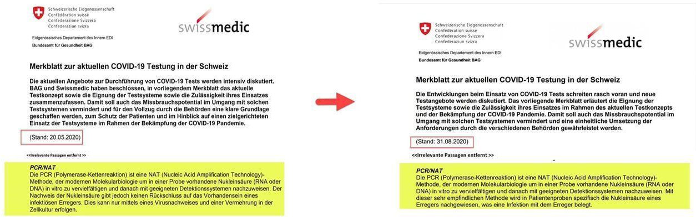

# Unvollständige, falsche Daten

Das Bundesamt für Gesundheit \(BAG\)  [schreibt](https://www.bag.admin.ch/bag/de/home/krankheiten/ausbrueche-epidemien-pandemien/aktuelle-ausbrueche-epidemien/novel-cov/situation-schweiz-und-international.html#2030838475):

> ### Epidemiologischen Lage in der Schweiz und im Fürstentum Liechtenstein
>
> \[...\]
>
> | 10.11.2020, 8 Uhr | Neu\* | Total seit Beginn der Epidemie |
> | :--- | ---: | ---: |
> | Laborbestätigte Infektionen | 5 980 | 235 202 |
> | Hospitalisierungen | 243 | 9 448 |
> | Todesfälle | 107 | 2 683 |
> | Covid-19-Test | 22 919 | 2 254 471 |
>
> \* seit 9.11.2020, 8 Uhr

Unter der Annahme, dass die gegenwärtig verwendeten SARS-CoV-2 Tests [eine Infektion nachweisen können,](unvollstaendige-daten.md#die-sars-cov-2-tests-koennen-keine-infektion-nachweisen) ist an diesen Daten nicht viel auszusetzen. Das Problem entsteht bei deren Interpretation. Viele Leser und fast alle Medien werden nämlich daraus ableiten, dass es 235202 Infizierte gibt/gab und 2683 an den Folgen der Infektion verstorben sind. **Diese Interpretation ist falsch**, die folgenden Abschnitte zeigen auf warum.

## Fehlerbehaftete Tests

Jeder medizinische Test hat Fehlerraten. Aus einem positiven Testresultat lässt sich nicht zwingend eine Infektion ableiten. Umgekehrt heisst ein negatives Resultat nicht, dass beim getesteten Menschen keine Infektion besteht. Auch relativ kleine Fehlerraten beim einzelnen Test können zu Gesamtergebnissen führen, die überraschend weit von der Realität abweichen. Ein Beispiel von [HIV Tests in Deutschland](https://de.wikipedia.org/wiki/Beurteilung_eines_bin%C3%A4ren_Klassifikators#HIV_in_der_BRD) demonstriert dies anschaulich:

> Somit liegt die [Wahrscheinlichkeit](https://de.wikipedia.org/wiki/Wahrscheinlichkeit), dass jemand, der nur mit dem [ELISA](https://de.wikipedia.org/wiki/Enzyme-linked_Immunosorbent_Assay)-Test positiv getestet würde, auch wirklich HIV-positiv wäre, bei nur 45 % \(positiver Vorhersagewert\). Dieser angesichts der sehr geringen Fehlerrate von 0,1 % niedrige Wert liegt darin begründet, dass HIV nur bei etwa 0,08 % der Bundesbürger auftritt.

Solche Ergebnisse können mit geeigneten Massnahmen \(z.B. mehrfaches Testen\) massiv verbessert werden, aber Rückschlüsse auf die Realität sind nur dann möglich wenn Verfahren und Fehlerraten dokumentiert sind. Bei den vom BAG publizierten Daten scheint dies nicht der Fall zu sein, **daher kann eine Interpretation der unvollständigen Daten fast beliebig weit von der Realität abweichen.**

## Die SARS-CoV-2 Tests können keine Infektion nachweisen

Beda M. Stadler, emeritierter Professor für Immunologie an der Universität Bern, schreibt [in einem Artikel](https://www.weltwoche.ch/ausgaben/2020-36/diese-woche/masken-der-angst-die-weltwoche-ausgabe-36-2020.html) folgendes:

> Es ist fraglich, was der PCR-Test, mit dem man keine akuten Infektionen nachweisen kann, für einen Nutzen haben soll, um Sars-CoV-2 zu bekämpfen. Für das Contact-Tracing ist er eigentlich unbrauchbar, weil es zu lange dauert, bis Resultate vorliegen. Hinzu kommt, dass eine junge Person mit intaktem Immunsystem, die positiv getestet wird, nicht and Covid-19 erkrankt. Trotzdem nennt das Bundesamt für Gesundheit \(BAG\) diese Fälle seit einiger Zeit "laborbestätigte Infektionen" und widerspricht damit eigenen Richtlinien.

In einem [ausführlichen Interview](https://www.youtube.com/watch?v=gvB0vuM5bek) legt der Anwalt Dr. Reiner Fuellmich dar, warum die gegenwärtig verwendeten Tests nicht in der Lage sind, eine Infektion nachzuweisen.

## **Positiver Test** ≠ **Erkrankung**

Selbst wenn man annimmt, dass die verwendeten Tests eine Infektion nachweisen können, sind bei der Sterberate folgende Überlegungen wichtig: Auch ein mehrfach bestätigter positiver SARS-CoV-2 Befund bedeutet nicht, dass der getestete Mensch an COVID-19 erkrankt ist \(COVID-19 ist die Krankheit die durch das SARS-CoV-2 Virus ausgelöst wird\). Er kann genauso gut ein asymptomatischer Träger des Virus sein. Ein positiv getesteter Toter kann darum an einer anderen Krankheit \(z.B. Lungenentzündung, Grippe\) erlegen sein, taucht aber in den Daten des BAG als "Todesfall mit laborbestätigter Infektion" auf. Ob ein positiver Toter nun tatsächlich wegen COVID-19 verstorben ist, ist in der Praxis wenn überhaupt nur mit einer aufwändigen Autopsie festzustellen. Das BAG scheint dazu keine Zahlen zu veröffentlichen.

## Das Bundesamt für Gesundheit ist unglaubwürdig

Die vom BAG verbreiteten Informationen sind unglaubwürdig. Damit ist jede mit BAG Zahlen gerechtfertigte Massnahme grundsätzlich in Frage zustellen. Hier sind nur 2 Beispiele:

### Infektionen in Clubs

In einer [Korrektur des BAG](https://www.bag.admin.ch/bag/de/home/das-bag/aktuell/news/news-02-08-2020.html) ist folgendes zu lesen:

> Es zeigt sich, dass gemäss den klinischen Meldeformularen, die uns durch Ärztinnen und Ärzte zugestellt werden, die meisten Ansteckungen im familiären Umfeld geschehen, gefolgt vom Arbeitsplatz. Ausgehlokale machen entgegen der Tabelle vom Freitag einen einstelligen Prozentsatz aus.

Wenn sich die meisten Leute im familiären Umfeld und bei der Arbeit anstecken \(wofür noch bis vor kurzem keinerlei Zwangsmassnahmen verordnet wurden\), dann machen die monatelangen drakonischen Massnahmen bei der Gastronomie wenig Sinn.

### Das BAG widerspricht neu dem Erfinder des PCR Tests

Am 20.05.2020 stand im [einem BAG Merkblatt](https://www.bag.admin.ch/dam/bag/de/dokumente/mt/k-und-i/aktuelle-ausbrueche-pandemien/2019-nCoV/merkblatt-swissmedic-covid-19-testung.pdf.download.pdf/Merkblatt_zur_aktuellen_COVID-19_Testung_in_der_Schweiz_Swissmedic_BAG.pdf) folgendes:

> Die PCR \(Polymerase-Kettenreaktion\) ist eine NAT \(Nucleic Acid Amplification Technology\)-Methode, der modernen Molekularbiologie um in einer Probe vorhandene Nukleinsäure \(RNA oder DNA\) in vitro zu vervielfältigen und danach mit geeigneten Detektionssystemen nachzuweisen. Der Nachweis der Nukleinsäure gibt jedoch keinen Rückschluss auf das Vorhandensein eines infektiösen Erregers. Dies kann nur mittels eines Virusnachweises und einer Vermehrung in der Zellkultur erfolgen.

Neu \(Stand 31.08.2020\) steht dort:

> Die PCR \(Polymerase-Kettenreaktion\) ist eine NAT \(Nucleic Acid Amplification Technology\)-Methode, der modernen Molekularbiologie um in einer Probe vorhandene Nukleinsäure \(RNA oder DNA\) in vitro zu vervielfältigen und danach mit geeigneten Detektionssystemen nachzuweisen. Mit dieser sehr empfindlichen Methode wird in Patientenproben spezifisch die Nukleinsäure eines Erregers nachgewiesen, was eine Infektion mit dem Erreger belegt.

Damit widerspricht das BAG neu dem Erfinder des PCR Tests, Kary Mullis, welcher zum PCR Test [folgendes sagte](https://www.bitchute.com/video/9agbhtUMGeV3/):

> It \[the PCR test\] doesn't tell you that you're sick. It doesn't tell you that the thing you ended up with really was gonna hurt you or anything like that.

